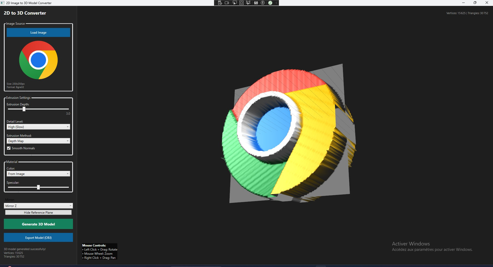
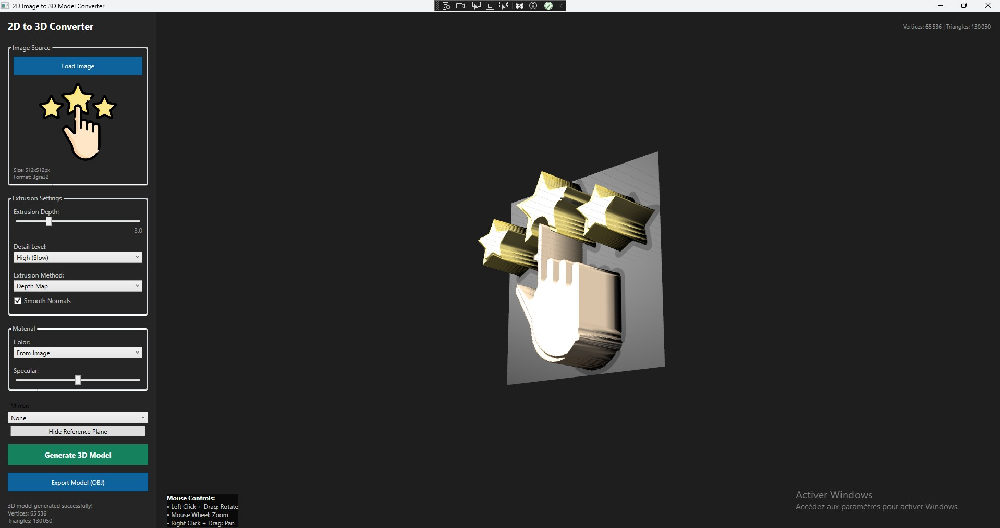
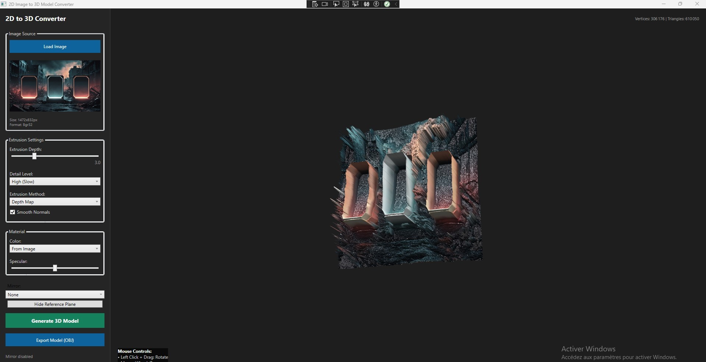
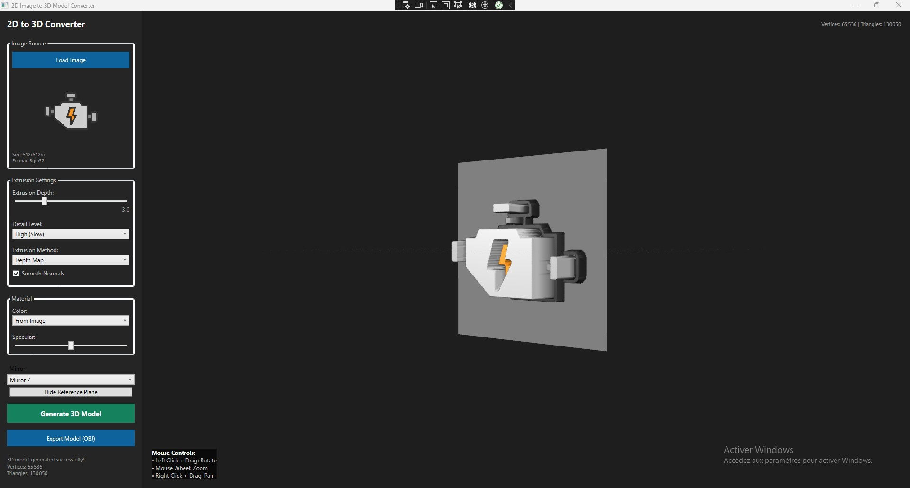
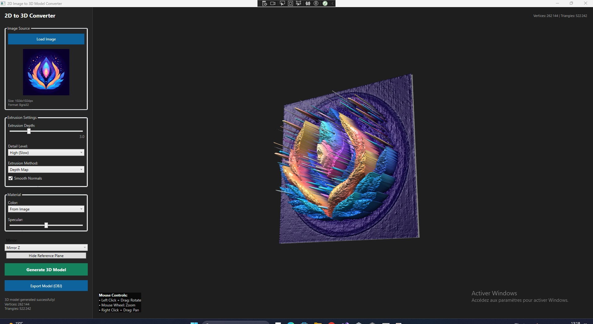
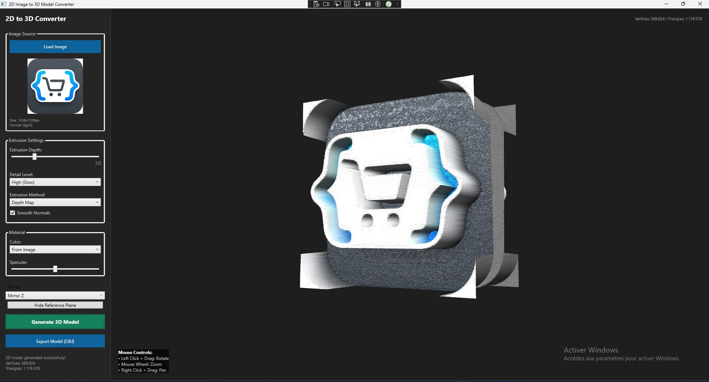

# 2D to 3D Model Generator

A **.NET WPF desktop application** that converts **2D images into usable 3D models** using a custom **extrusion algorithm based on image color data**.

The goal of this project is to provide a simple way to transform flat images (silhouettes, height maps, or colored shapes) into 3D geometry that can be further edited or used in 3D software and game engines.

---

## ✨ Features

- Convert 2D images into 3D models
- Extrusion algorithm based on pixel color / intensity
- Real-time 3D preview before export
- Export generated models for further use
- Simple and clean WPF user interface

---

## 🧠 How It Works

The application analyzes the image pixels and uses their **color or intensity values** to determine the **extrusion depth**.  
Brighter or specific colors result in higher geometry, producing a depth-based 3D model from a flat image.

This approach is especially useful for:
- Height maps
- Icons and silhouettes
- Simple concept models
- Procedural 3D generation

---

## 🖼️ Screenshots

Below are some screenshots from the application:

> Screenshots are located in the `assets` folder.

---

## 🛠️ Tech Stack

- **.NET (C#)**
- **WPF**
- 3D rendering using `Viewport3D`
- Custom extrusion logic based on image color data
- Exporting 3D Models Using AssmipNet

---

## 📦 Use Cases

- Game development
- Rapid prototyping
- Educational purposes
- Procedural modeling experiments

---

## 📄 License

This project is licensed under the terms of the included **LICENSE** file.
